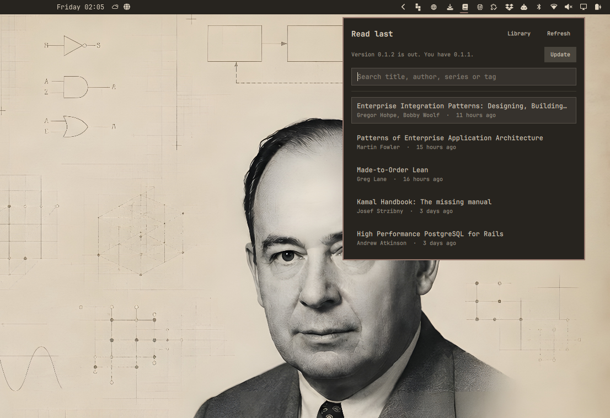
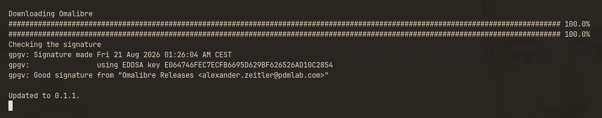
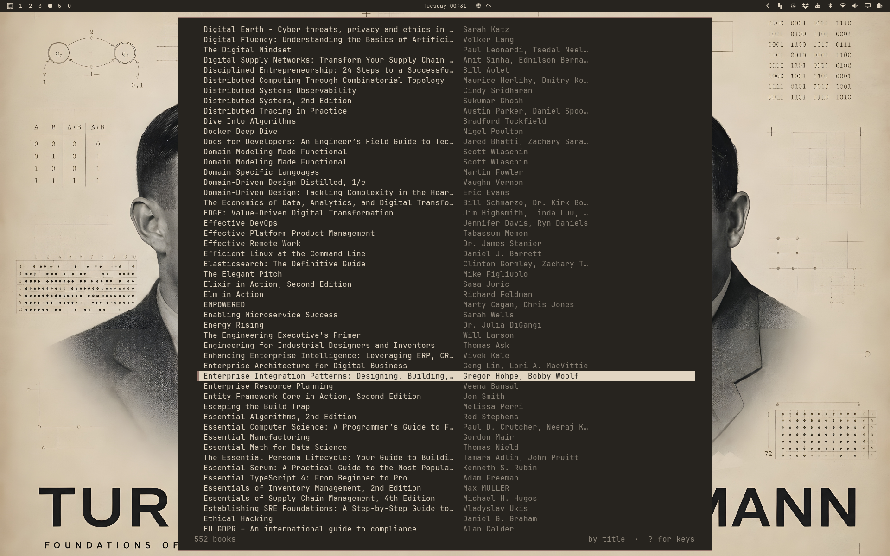
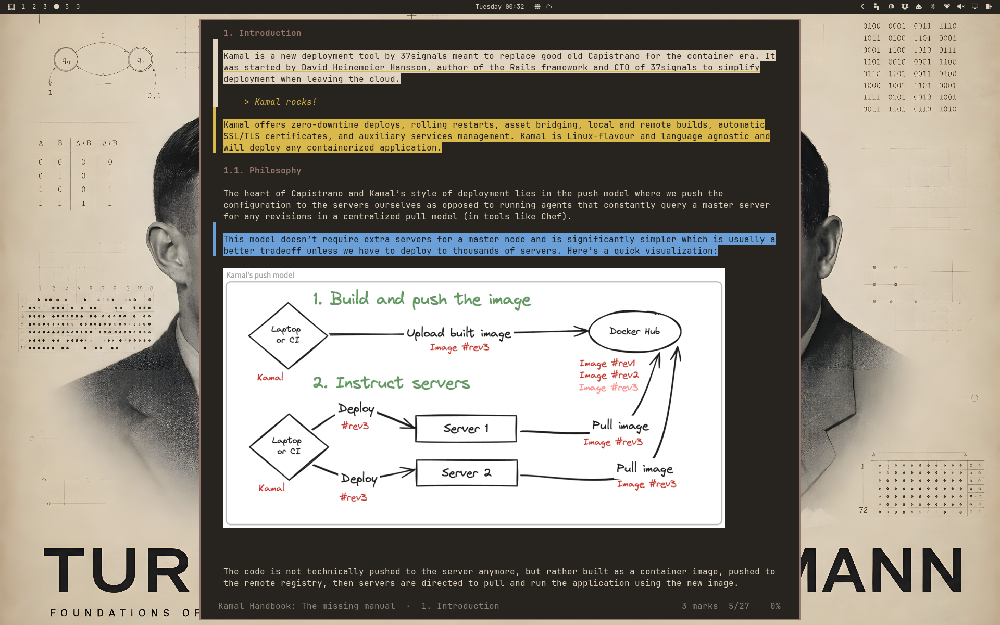
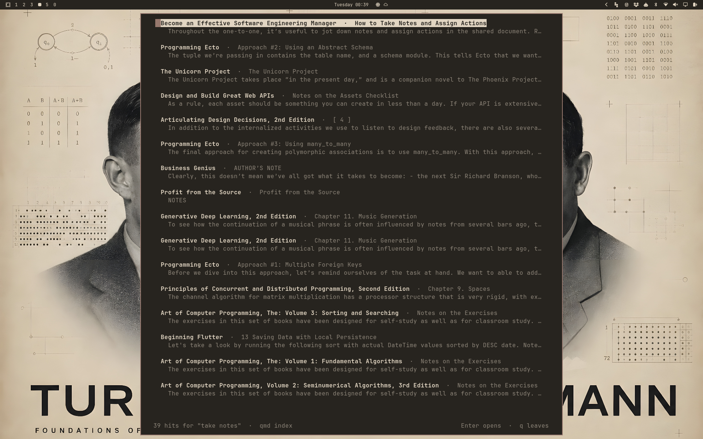
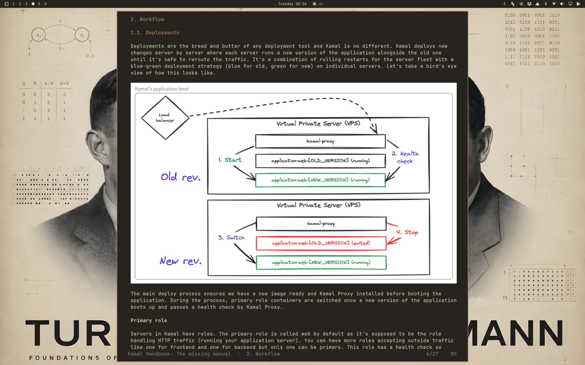
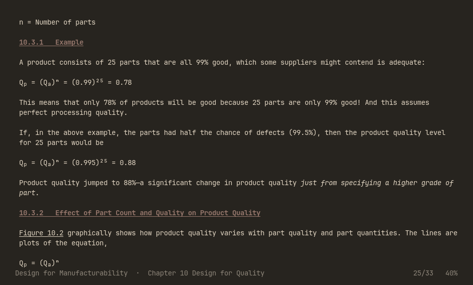

# Omalibre

**The AI native bookshelf for Omarchy**

Read your ebooks in the terminal, and keep your library in order while you do.
Vim keys, highlights and notes that survive across machines, pictures where your
terminal can show them, and a page that takes on every theme you switch to. Ask
Claude about any book on the shelf, including what you wrote in the margin, and
search the whole library by meaning once you add [qmd](https://github.com/tobi/qmd).


## Install

On Omarchy, add the plugin and let the bar do the rest:

```bash
omarchy plugin add https://github.com/AlexZeitler/omalibre.git --enable
```

That puts a book icon in your bar. Open it and it offers to fetch Omalibre if
it is not there yet. See [In the Omarchy bar](#in-the-omarchy-bar).

What it fetches is a 64-bit Linux build with no dependencies at all, so the age
of your distribution does not matter. It lands in `~/.local/bin`. If your shell
cannot find `omalibre` afterwards, that directory is not on your `PATH`.

The plugin checks the release signature before it unpacks anything, and
installs nothing if the check fails. See
[Verifying a release](#verifying-a-release).

### Or build it yourself

You need Rust:

```bash
mise use -g rust@latest      # or: sudo pacman -S rust
```

Then:

```bash
cargo install --git https://github.com/AlexZeitler/omalibre
mise reshim                  # only if you installed Rust with mise
```

This puts `omalibre` in `~/.cargo/bin`.

On Omarchy there is nothing else to do. The first start hooks Omalibre into your
theme, and from then on it follows every theme you switch to, while you read.
Elsewhere it uses built-in colours.

Working from a clone, `./install-theme.sh` links the colour template instead of
copying it, so `git pull` keeps it current.

### Verifying a release

Every release is signed. The public key is not published beside the release,
where a rewritten release could replace it, but shipped inside the plugin at
`omarchy/omalibre-releases.asc`:

```
E064 746F EC7E CFB6 695D  629B F626 526A D10C 2854
```

The plugin runs this check for you. By hand it is:

```bash
cd "$(mktemp -d)"
base=https://github.com/AlexZeitler/omalibre/releases/latest/download
curl -fL -O "$base/omalibre-x86_64-linux.tar.gz"
curl -fL -O "$base/omalibre-x86_64-linux.tar.gz.asc"
curl -fL -O https://raw.githubusercontent.com/AlexZeitler/omalibre/master/omarchy/omalibre-releases.asc

gpg --dearmor < omalibre-releases.asc > release-key.gpg
gpgv --keyring "$PWD/release-key.gpg" \
  omalibre-x86_64-linux.tar.gz.asc omalibre-x86_64-linux.tar.gz
```

`gpgv` says `Good signature` or it fails. It reads only the keyring given to
it and leaves your own alone.

## In the Omarchy bar

The plugin puts your reading one click away:

```bash
omarchy plugin add https://github.com/AlexZeitler/omalibre.git --enable
```

That puts a book icon in your bar. Is Omalibre not installed yet, the panel
says so and fetches it for you.


From then on the panel lists the five books you read last, newest first, with
the author and when you last had them open. Type in the box to search the whole
library by title, author, series or tag. Click a book and it opens in a
terminal, at the page and line where you stopped.


The box has the keyboard from the start. Arrow keys walk the list, `Enter`
opens the book under the cursor, `Escape` closes the panel.

`Library` at the top opens the reader on the library itself, for when the book
you want is not among the five and you would rather browse than type.

Is a newer release out, the panel names both versions and offers `Update`.



The update takes the same route the first install takes, so the signature is
checked before anything is unpacked.



Which version is out the panel reads off the redirect behind `releases/latest`,
which costs one request and no API budget. A machine that cannot reach GitHub
says nothing about updates and lists your books as usual.

`omarchy plugin update` is a different thing: it updates the plugin, not the
reader. Both are wanted when both moved on.

One case the button cannot reach: a copy from `cargo install` lives in
`~/.cargo/bin`, and the update always writes to `~/.local/bin`. The installer
says so when it finds both, because from there your `PATH` decides which one
starts.

Move the icon where you want it:

```bash
omarchy bar move alexzeitler.omalibre --section left
```

## Start reading

Point Omalibre at your books once:

```bash
omalibre --scan ~/Books
```

It looks through the directory and every directory below it, and remembers every
EPUB it finds. Then open the library:

```bash
omalibre
```



Pick a book with `j` and `k`, open it with `Enter`. Next time you open that book
it continues where you stopped, on the right page and the right line.

To read a single file without adding it to the library, name it:

```bash
omalibre ~/Downloads/some-book.epub
```

## Keys

Press `?` at any time for the full list. The ones you need first:

| Key | What it does |
|-------------------|--------------------------------------------|
| `j` `k` | one line down, up |
| `Space` `Backspace` | one page down, up |
| `L` `H` | next chapter, previous chapter |
| `t` | table of contents |
| `/` | search this book, `n` and `N` step through |
| `i` | put a cursor in the text |
| `q` | back to the library |
| `Q` | quit |

## Highlight and take notes

Press `i` to put a cursor in the text, then `v` to start selecting. Move with
`h l w b`, or take whole lines with `V`. Then:

- `y` highlights the passage
- `m` followed by `y g b r p` picks yellow, green, blue, red or purple
- `a` writes a note in your editor



A passage with a note reads inverted and shows the note underneath, so you see
what you thought about it while you read. A plain highlight is coloured. The
narrow column left of the text marks both, which helps when you are scrolling
past.

With the cursor on a marked passage, `e` changes the note, `d` deletes, and `m`
with a colour recolours it. `A` lists everything you marked in the book, and
`Enter` there jumps to the passage.

Your notes are yours: they live in a plain text file, one line per change, and
nothing is stored inside your book files.

## Follow links

Footnotes and cross references work. With the cursor on a link, `Enter` follows
it and `Ctrl-o` brings you back to where you were, exactly on the link you came
from. Books whose links are subtly broken usually still work.

## Search the whole library

```bash
omalibre --find "optimistic locking"
```

You get a list of hits with book, chapter and the sentence that matched. `Enter`
opens the book right there.



This works out of the box. If you install [qmd](https://github.com/tobi/qmd), the
search gets faster and starts finding things by meaning rather than by wording:

```bash
omalibre --export --reindex --embed
```

## Pictures

Diagrams and screenshots appear in the text. How sharp they are depends on your
terminal: Ghostty and kitty show them pixel-perfect, foot nearly so, and
everything else falls back to coloured blocks, which is coarse but always works.
Omalibre asks your terminal at startup and picks the best it can do.



Inside tmux, pictures always use the coarse mode. That is not a shortcoming of
your terminal: tmux manages the screen itself and would leave pictures behind
when you scroll.

## Formulas

Technical books carry their mathematics as MathML, and a terminal has no way to
stack one part of a formula over another. Omalibre sets it on one line instead.
Indices become real characters wherever there is one, so `(Q_a)^n` arrives as
`(Qₐ)ⁿ` rather than as `(Qa)n`, where the exponent would read as part of the
number.



Where a character has no raised or lowered form, the index is written out:
`e^(−λt)`. That is longer, but it never hides which part is the index. The same
goes for a subscript in running prose, so `R<sub>s</sub>` reads as `Rₛ`.

## Keep your place across machines

Reading positions and notes live in one directory. Point it at a synchronised
folder and every machine you read on stays in step:

```toml
# ~/.config/omalibre/config.toml
journal_dir = "~/Dropbox/omalibre/journal"
```

Each machine writes only its own file there, so nothing can collide, and no
conflict copies appear. Where two machines disagree about a page, the later one
wins.

Books themselves are recognised by their content, not by their path. Move a file,
rename it, reorganise your shelves: your notes and your place stay with the book.

## Settings

`~/.config/omalibre/config.toml`, written with comments on first start:

```toml
# Reading width in columns. Leave out to use the whole window.
max_width = 66

# How pictures are drawn: kitty, sixel or half-blocks.
# Left out, your terminal is asked.
images = "sixel"
```

## Ask Claude about your books

Omalibre can hand your library to Claude, including the notes you wrote:

```bash
claude mcp add omalibre --scope user -- omalibre --mcp
```

Then you can ask things like "what did I highlight in the Kamal Handbook", "where
did I stop in which book", or "find where this book explains snapshots". Claude
reads the library through Omalibre, so what it sees is always current.

Bear in mind that chapter text sent this way leaves your machine.

## Library housekeeping

```bash
omalibre --scan ~/Books      # add new books, notice moved ones
omalibre --list              # the library on the command line
omalibre --list --filter pg  # only the books that match
omalibre --recent            # the five you read last
```

Add `--json` to `--list`, and `--recent` prints JSON anyway: that is how the
bar widget asks.

Scanning again is cheap and never overwrites anything you corrected by hand.

## What it needs, and what it writes

The bar widget is one QML file plus two shell scripts and a public key,
running inside `omarchy-shell`. It links against nothing. It calls `omalibre`
for its rows, `omarchy-launch-tui` to open a book, and, only when you press the
install button, `curl`, `gpg`, `gpgv` and `tar`. GnuPG is already there: pacman
itself depends on it. The book icon wants a Nerd Font, which the Omarchy bar
already uses. The reader is a statically linked binary and needs nothing at
all at runtime. [qmd](https://github.com/tobi/qmd) is optional and only for
search by meaning.

The widget writes nothing of yours. The install button downloads into
`~/.local/bin`, and only on that press, and only after the release signature
checks out. See [Verifying a release](#verifying-a-release).

On its first start the reader writes two files and overwrites neither, so a
file you edited or linked yourself stays as it is:

- `~/.config/omalibre/config.toml`, the commented settings file
- `~/.config/omarchy/themed/omalibre.toml.tpl`, the colour template, and only
  where Omarchy is installed

Where it did place that template, it applies your current theme once more so
the colours render straight away. That re-runs the theme you already have; it
changes neither your choice nor your background.

## Removing it

```bash
omarchy plugin remove alexzeitler.omalibre
```

That takes the widget off the bar and deletes the clone. The reader is one
file, so `rm ~/.local/bin/omalibre`, or `cargo uninstall omalibre` if you
installed it that way.

What you wrote stays behind until you say otherwise. Mind the first line: the
journal holds every reading position and every note you took.

```bash
rm -rf ~/.local/share/omalibre                   # journal and read model
rm -rf ~/.config/omalibre                        # settings
rm ~/.config/omarchy/themed/omalibre.toml.tpl    # colour template
```

## License

MIT, in `LICENSE` and in the plugin's `manifest.json`.

## Not there yet

- Editing metadata: series, tags and ratings can be stored, but there is no
  editor for them yet. Most books carry no series information of their own.
- MOBI, AZW3 and PDF are not read yet, only EPUB.
- A few books with genuinely broken markup lose individual chapters. The rest of
  such a book stays readable.
